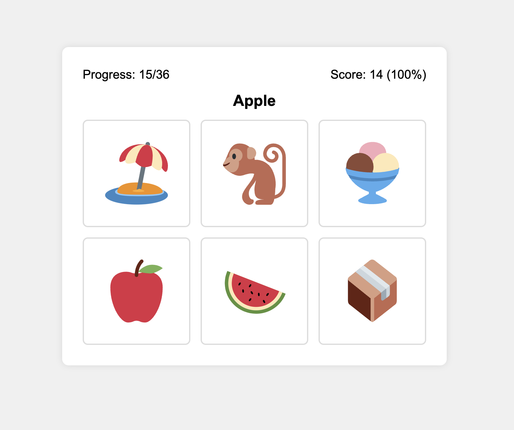

# English Flashcards

English Flashcards is an interactive web-based game designed to help kids learn English vocabulary through a fun and engaging emoji matching exercise.



## 🌐 Play Now

You can play the game online at: [https://english.lahdekorpi.com](https://english.lahdekorpi.com)

## 🎮 How to Play

1. You'll see a word in English at the top of the screen.
2. Below the word, there will be a grid of emojis.
3. Click on the emoji that best matches the word shown.
4. If you're correct, the emoji will turn green. If not, it will turn red.
5. Your score is updated after each answer.
6. Try to match as many words correctly as you can!

## 🚀 Features

- Responsive design that works on both desktop and mobile devices
- Randomized emoji selection for varied gameplay
- Score tracking to monitor progress
- Simple and intuitive user interface

## 🛠️ Technical Details

This project is built using:

- HTML5
- CSS3
- JavaScript (ES6+)

The game dynamically loads emoji data from a JSON file and creates an interactive game board.

## 🖥️ Local Development

To run this project locally:

1. Clone the repository:
   ```
   git clone https://github.com/lahdekorpi/english-flashcards.git
   ```
2. Navigate to the project directory:
   ```
   cd english-flashcards
   ```
3. Open the `index.html` file in your web browser.

Note: You may need to run a local server to avoid CORS issues when loading the JSON file.

## 🤝 Contributing

Contributions, issues, and feature requests are welcome! Feel free to check the [issues page](https://github.com/lahdekorpi/english-flashcards/issues).

## 📜 License

This project's code is open source and available under the [MIT License](LICENSE).

The emoji graphics are from [Twemoji](https://github.com/twitter/twemoji) and are licensed under [CC-BY 4.0](svg/LICENSE-GRAPHICS). 

## 👨‍💻 Author

- **Toni Lähdekorpi** - [GitHub](https://github.com/lahdekorpi)

## 🙏 Acknowledgements

- Emoji graphics provided by [Twemoji](https://github.com/twitter/twemoji) - Twitter's open source emoji project. License: [CC-BY 4.0](svg/LICENSE-GRAPHICS)